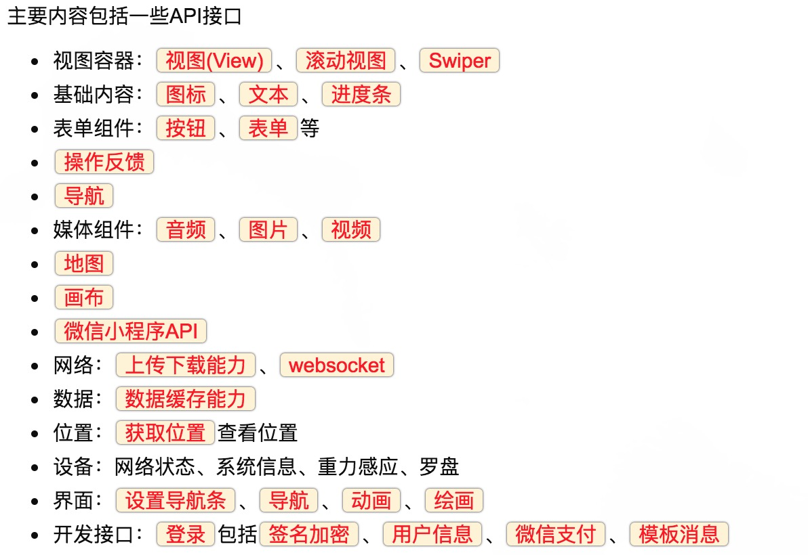

# API

## 概述

| API                            | 类型          | 说明                                                                   |
|--------------------------------|-------------|----------------------------------------------------------------------|
| React.createElement            | 内部 API      | 创建元素, 框架在内部会帮你调用这个方法，业务代码中不要用它                                       |
| React.createRef                | &nbsp;      | 不存在                                                                  |
| React.forwardRef               | &nbsp;      | 不存在                                                                  |
| React.api                      | &nbsp;      | 相当于微信的 wx, 支付宝小程序的 my，百度小程的 swan,为了方便编译，请不要在业务代码中直接用 wx,要用 React.api |
| React.getApp                   | &nbsp;      | 相当于微信的 getApp                                                        |
| React.getCurrentPages          | &nbsp;      | 相当于微信的 geCurrentPages                                                 |
| React.Component                | &nbsp;      | 所有组件的基类                                                              |
| React.toComponent/useComponent | 内部 API      | 用来创建组件                                                               |
| React.toRenderProps            | 内部 API      | 用来代替 render 属性对应的函数                                                  |
| React.toClass                  | 内部 API      | 用来转译 es6 类                                                           |
| React.toStyle                  | 内部 API      | 用来转译样式                                                               |
| React.toPage/registerPage      | 内部 API      | 页面组件会自动在底部添加这方法                                                      |
| onShow                         | 页面组件的生命周期钩子 |                                                         |
| onHide                         | 页面组件的生命周期钩子 |                                                          |
| onPageScroll                   | 页面组件的事件     | 监听用户滑动页面事件                                                           |
| onShareAppMessage              | 页面组件的事件     | 用于返回分享的内容                                                            |
| onReachBottom                  | 页面组件的事件     | 监听用户上拉触底事件                                                           |
| onPullDownRefresh              | 页面组件的事件     | 监听用户下拉刷新事件                                                           |
| componentWillMount             | 组件的生命周期钩子   | 相当于小程序的onLoad   props 中有 path, query 等路由相关信息                      |
| componentWillUpdate            | 组件的生命周期钩子   | 在小程序中没什么用                                                            |
| componentDidMount              | 组件的生命周期钩子   | 相当于小程序的onReady                                                       |
| componentDidUpdate             | 组件的生命周期钩子   | 在小程序中没什么用                                                            |
| componentWillUnmount           | 组件的生命周期钩子   | 相当于小程序的onUnload                                                      |
| componentWillRecieveProps      | 组件的生命周期钩子   |                                                                      |
| shouldComponentUpdate          | 组件的生命周期钩子   |                                                                      |
| componentDidCatch              | 组件的生命周期钩子   |                                                                      |
| getChildContext                | 组件的方法       |                                                                      |
| setState                       | 组件的方法       | 更新页面                                                                 |
| forceUpdate                    | 组件的方法       | 更新页面                                                                 |
| refs                           | 组件实例上的对象    | 里面保存着子组件的实例（由于没有 DOM，对于普通标签来说，  虽然也能保存着它的虚拟 DOM )               |
| render                         | 组件的方法       | 里面必须使用 JSX ，其他方法不能存在 JSX，不能显式使用 createElement                        |

