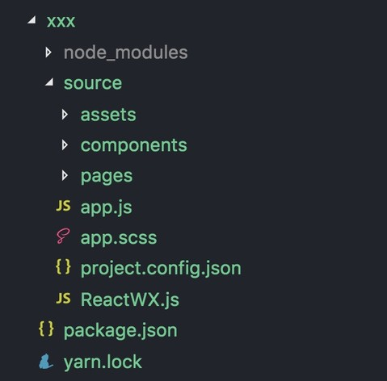

# alias别名配置

在项目package.json中，可配置别名， 减少引用的麻烦。

假设我们有一个叫xxx的项目，用`nanachi init xxx` 创建后，大概是这个样子



我们打开package.json在里面添加nanachi对象，nanachi下面再添加alias对象
假设我们在assets目录下有一个global.scss，我不想在pages在很深层次的目录中每次都要
｀../../../assets/global.scss`地引用它。可以定义一个@assets别名，指向assets目录。
由于当前执行命令在xxx目录下，assets又在source里，于是其路径为 `source/assets`

```json
{
    "license": "MIT",
    "version": "1.0.0",
    "name": "qunar",
    "nanachi": {
        "alias":  {
            "@assets":"source/assets"
        }
    },
    "dependencies": {
        "regenerator-runtime": "^0.12.1"
    }
}
```

使用方式，我们在某一个页面(/pages/xxx/yyy/index.js)添加一个index.scss, 其位置为`pages/xxx/yyy/index.scss`

```javascript
//index.js
import React from '@react';
import './index.scss';
class P extends React.Component {
    //略
}
export default P
//-------------- 略

//index.scss

@import '@assets/global.scss'
.aaa {//其他样式
  color:red;
}
```

在默认情况下， 每个项目的package.json/ nanachi / alias对象会添加两个别名@components与@react。因此添加别名时不要与它们冲突。

在业务开发中，我们把一些没有视图的业务逻辑放到common目录下，建议不同部门都有自己的XXXCommon.
```shell
src
   |--components
   |    |--HotelDialog
   |    |     └──index.js  //必须以index.js命名，里面的类名 必须 与文件夹名一样, 如HotelDialog
   |    |--HotelXXX
   |    |--FlightYYY
   |    └── ...
   |--pages
   |    |--hotel
   |    |--flight
   |    |--holiday
   |    |--strategy
   |    └── ...
   |--common
   |    |--hotelCommon
   |    |    └── ...
   |    |--flightCommon
   |    |--holidayCommon
   |    |--strategyCommon
   |    └── ...
   |--app.js
```
那么各部门可以这样定义自己的别名

```json
{
    "license": "MIT",
    "version": "1.0.0",
    "name": "qunar",
    "nanachi": {
        "alias":  {
            "@assets":"source/assets",
            "@hotel" :"source/common/hotelCommon",
            "@flight" :"source/common/trainCommon",
            "@flight" :"source/common/flightCommon"
        }
    },
    "dependencies": {
        "regenerator-runtime": "^0.12.1"
    }
}
```
使用方式：

```jsx
import React from '@react'
import trainPay from '@flight/pay';
//....其他代码

```
