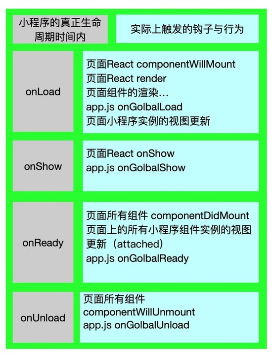
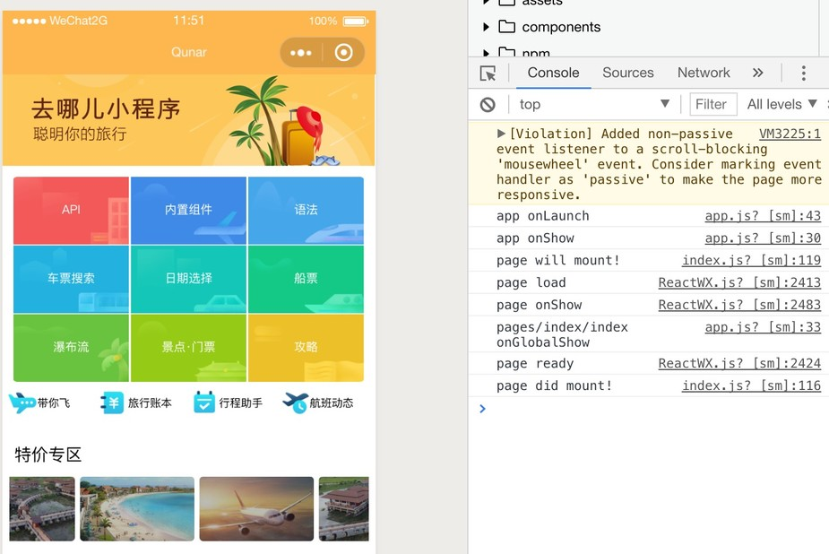

# 页面组件与生命周期

页面定义在 `pages` 目录下的index.js文件中。这样一来，就会存在这么多index.js,因此它们必须包含在相应的文件夹中，而这些文件夹不要以index命名。
>原因：快应用有一个manifest.json文件, 里面有一个router对象，包含所有页面
```json
"router": {
    "entry": "pages/index",
    "pages": {
      "pages/index": {
        "component": "index"
      },
      "pages/demo/syntax/index": {
        "component": "index"
      },
      "pages/demo/syntax/api": {
        "component": "index"
      },
      "pages/demo/syntax/await": {
        "component": "index"
      },
      "pages/demo/syntax/children": {
        "component": "index"
      },
      "pages/demo/syntax/extend": {
        "component": "index"
      },
      "pages/demo/syntax/if": {
        "component": "index"
      }
    }
}
```
然后我们页面切换是通过React.api.redirectTo实现
```javascript
function createRouter(name) {
    return function (obj) {
        var router = require('@system.router');
        var params = {};
        var uri = obj.url.slice(obj.url.indexOf('/pages') + 1);
        uri = uri.replace(/\?(.*)/, function (a, b) {
            b.split('=').forEach(function (k, v) {
                params[k] = v;
            });
            return '';
        }).replace(/\/index$/, '');
        console.log(uri, "createRouter")
        router[name]({
            uri:"/"+ uri,
            params: params
        });
    };
}
```
因此文件名目录名好重要！


它必须是一个有状态的 React 组件。JSX 只能出现在 `render()` 方法里，它会编译成相应的 `wxml` 文件，因此不能使用 R `React.createElement()`代替 JSX。有关 JSX 的注意事项可以看[这里](jsx.md)。

页面组件与components目录下的通用组件有一些特异点，它是多出了componentDidShow, componentDidHide这两个生命周期钩子，与onPullDownRefresh onReachBottom onPageScroll onShareAppMessage这些事件。并且在config中能指定tabBar与分享按钮。

应用组件更新 `state` 必须通过 `this.setState` 函数。

比如：

```jsx
//pages/train/index.js
import React from '@react';

class P extends React.Component {
  constructor() {
    super();
    this.state = {
      iconSize: [20, 30, 40, 50, 60, 70],
      text: 'this is first line\nthis is second line'
    };
  }
  static config = {};

  add() {
    this.setState({
      text: this.state.text + '\nthis is new line'
    });
  }

  remove() {
    var textAry = this.state.text.split('\n');
    if (!textAry.length) return;
    textAry.pop();

    this.setState({
      text: textAry.join('\n')
    });
  }
  componentWillMount() {
    console.log('base componentWillMount');
  }
  componentDidMount() {
    console.log('base componentDidMount');
  }
  render() {
    return (
      <div class="container">
        <div class="item-list">
          <h2 class="item-list-hd">Icon</h2>
          <div class="group">
            {this.state.iconSize.map(function(item) {
              return <icon type="success" size={item} />;
            })}
          </div>
        </div>
      </div>
    );
  }
}

export default P;
```

## 页面的生命周期

页面组件会依次触发如下生命周期钩子

```shell
componentWillMount或getDerivedStateFromProps -> 
onGlobalLoad -> onShow -> onGlobalShow ->
componentDidMount -> onGlobalReady 
# 只有页面组件才有onShow, onHide钩子，普通组件没有这两个钩子
```

如果对页面组件进行setState,会依次触发如下生命周期钩子

```shell
shouldComponentUpdate(如果return false, 后面的不会触发) ->
componentWillUpdate或getDerivedStateFromProps -> 
componentDidUpdate
# componentWillMount/Update/ReceiveProps这三个钩子是 React15的旧钩子，如果定义了它们
# 就不会触发React 16的新钩子getDerivedStateFromProps
```

如果用户从A页面跳转到B页面，是不会触页面组件的componentWillUnmount(即onUnload),而是触发页面的onHide钩子与
app.js上的onGlobalHide钩子。然后再依次触发B的componentWillMount，onGlobalLoad，onShow。。。



当然，除了页面的生命周期及页面上所有子组件的生命周期，应用本身还有生命周期，实际上我们看到的生命周期触发顺序是这样的。



注： 页面组件必须使用 es6 风格来引入依赖与导出自己。

它的静态属性 config 会抽取出来生成对应的 JSON 配置对象，有关配置项可以看[这里](https://developers.weixin.qq.com/miniprogram/dev/framework/config.html#%E9%A1%B5%E9%9D%A2%E9%85%8D%E7%BD%AE)
